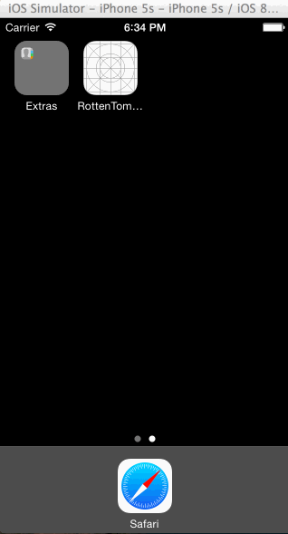

# Rotten Tomatoes Week 2 Submission

This is a week 2 assignment for Yahoo iOS class building a Rotten Tomatoes client showing latest movies in theater and on DVD.

Time spent: 24 hours spent in total

Completed user stories:

 * [x] Required: User can view a list of movies from Rotten Tomatoes
 * [x] Required: Poster images should be loading asynchronously
 * [x] Required: User can view movie details by tapping on a cell
 * [x] Required: User sees loading state while waiting for movies API implemented using 3rd party libraries called 'SVProgressHUD'
 * [x] Required: User sees error message when there's a networking error. Using 3rd party library 'TSMessage'
 * [x] Required: User can pull to refresh the movie list.
 
 * [x] Optional: Customize the navigation bar. (optional)
 * [x] Optional: Add a tab bar for Box Office and DVD
 * [x] Optional: Add a search bar
  
Walkthrough of all user stories:

GIF created with [LiceCap](http://www.cockos.com/licecap/).

